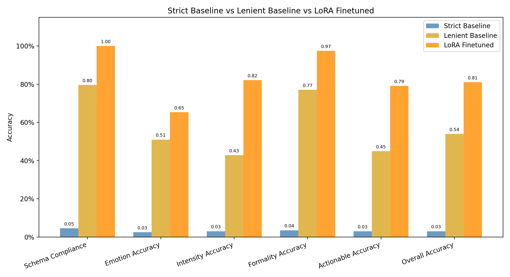

# Phi3-mini Refinement via LoRA Training Pipeline

Fine-tuning Phi-3 Mini 4k Instruct using LoRA to generate structured JSON output reliably. Trained on AWS EC2 G4dn.xlarge, tracked with Weights and Biases, adapter saved as a reusable artifact.

## What This Project Does

Large language models can understand a task without being able to format their output reliably. This project demonstrates that gap and closes it with LoRA fine-tuning.

The task is structured emotion analysis. Given a short text, the model must output a valid JSON object with four fields: emotion, intensity, formality, and actionable. The base model understood the schema semantically but produced corrupted unparseable JSON in most cases. After LoRA fine-tuning, schema compliance reached 100% and overall field accuracy improved from 54% to 81%.

## Results

| Metric | Strict Baseline | Lenient Baseline | LoRA Finetuned |
|---|---|---|---|
| Schema Compliance | 4.6% | 79.6% | 100% |
| Emotion Accuracy | 2.6% | 51.0% | 65.3% |
| Intensity Accuracy | 3.1% | 42.9% | 82.1% |
| Formality Accuracy | 3.6% | 77.0% | 97.5% |
| Actionable Accuracy | 3.1% | 44.9% | 79.1% |
| Overall Accuracy | 3.1% | 53.9% | 81.0% |



Strict baseline applies standard JSON parsing. Lenient baseline applies fuzzy extraction to recover semantically correct outputs that failed due to formatting issues. The distinction matters - the base model was not ignoring the task, it was failing on output format reliability.

## Schema

Input: a short natural language text expressing emotion

Output:
```
    {
      "emotion": "sadness | joy | love | anger | fear | surprise",
      "intensity": "low | medium | high",
      "formality": "formal | informal",
      "actionable": true | false
    }
```
## Dataset

Input texts sourced from the dair-ai/emotion dataset. Labels for intensity, formality, and actionable were generated using AWS Bedrock (Claude Haiku) with the base emotion label as an anchor. Raw dataset rows are not committed to this repository. Run 01_dataset_preparation.ipynb to regenerate.

Citation:
```
    @inproceedings{saravia-etal-2018-carer,
        title = "{CARER}: Contextualized Affect Representations for Emotion Recognition",
        author = "Saravia, Elvis and Liu, Hsien-Chi Toby and Huang, Yen-Hao and Wu, Junlin and Chen, Yi-Shin",
        booktitle = "Proceedings of the 2018 Conference on Empirical Methods in Natural Language Processing",
        year = "2018",
        url = "https://www.aclweb.org/anthology/D18-1404"
    }
```
## Stack

- Model: microsoft/Phi-3-mini-4k-instruct
- Fine-tuning: PEFT LoRA, HuggingFace Trainer
- Data labeling: AWS Bedrock, Claude Haiku
- Training compute: AWS EC2 G4dn.xlarge (T4 GPU)
- Infrastructure: Terraform
- Experiment tracking: Weights and Biases
- Storage: AWS S3

## LoRA Configuration

- Rank: 16
- Alpha: 32
- Dropout: 0.05
- Target modules: qkv_proj, o_proj, gate_up_proj, down_proj
- Trainable parameters: 25M out of 3.8B (0.65%)
- Epochs: 3
- Learning rate: 2e-4
- Effective batch size: 16 (batch 4, gradient accumulation 4)

## Reproducing This Project

Step 1 - Environment

Copy .env.example to .env and fill in your AWS credentials.

Build and start the local Jupyter container:
```
    docker build -t phi3-lora .
    docker run -it --rm -p 8888:8888 -v %cd%:/work phi3-lora
```
Step 2 - Dataset

Run 01_dataset_preparation.ipynb. This downloads the emotion dataset from HuggingFace, calls AWS Bedrock to enrich labels, splits the data, and uploads to S3.

Step 3 - Infrastructure

An EC2 G4dn.xlarge instance was utilized for this project, having a T4 GPU, S3 read/write access via an IAM role, and outbound internet access to reach HuggingFace and Weights and Biases. This project used Terraform to provision the infrastructure - the configuration is included in the terraform directory for reference.

Note: SSH is not required. EC2 access in this project was via AWS SSM Session Manager, which works through HTTPS and requires no open ports. This is useful in environments where outbound port 22 is blocked.

Step 4 - Baseline Evaluation

Create a .env file on your GPU machine following the format in gpu.env.example. This file is never committed and must be created manually on the GPU machine. Then run scripts/baseline_eval.py. This loads the base model, runs inference on the test set, and saves baseline metrics.

Step 5 - Training

Run scripts/train.py on your GPU machine. Loss curves and hyperparameters are logged to Weights and Biases automatically.

Step 6 - Fine-tuned Evaluation

Run scripts/finetuned_eval.py on your GPU machine. This loads the base model with the LoRA adapter applied and evaluates on the same test set used in Step 4.

Step 7 - Analysis

Run 02_evaluation.ipynb locally. This notebook only needs the metrics JSON files and result JSONL files from the previous steps - no GPU required.


## Known Limitations

- Intensity, formality, and actionable labels were generated by Claude Haiku, not human annotators. The model learned Claude's labeling style.
- Love and surprise are underrepresented in the dataset (74 and 33 training examples respectively), which limits per-class accuracy for those emotions.
- Results reflect this specific schema and dataset. Generalization to other structured output tasks is not evaluated.

## Environment Variables

See .env.example for all required variables.